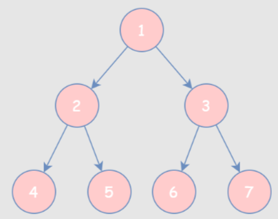

#### 198. 打家劫舍

动态规划

```
nums.length == 1, nums[0]
nums.length == 2, max(nums[0], nums[1])
nums.length > 2, result[i] = max(result[i - 1], result[i - 2] + nums[i])
```

#### 203. 删除指定链表元素

可以创建一个 `dummyNode `作为头节点用 `dummyNode.next` 来返回结果

#### 206. 反转链表

- 迭代，三个指针 `pre, curr, next`

  ```java
  while (curr != null) {
      next = curr.next;
      curr.next = pre;
      pre = curr;
      curr = next;
  }
  ```

- 递归

  ```java
  ListNode result = reverseList(head.next);
  head.next.next = head;
  head.next = null;
  return result;
  ```

#### 665. 能否改变一个元素使数组非递减

需要考虑两种情况

```
从 1 开始遍历整个数组
	1 需要特殊考虑

	if (当前值 < 前一个) {
		// 判断怎么修改
		if (当前值 >= 前两个) {
			nums[i - 1] = nums[i]; // 把前面那一个变小 [0, 4, 2, 3] -> [0, 2, 2, 3]
		} else {
			nums[i] = nums[i - 1]; // 把当前值变大 [0, 4, -1, 5] -> [0, 4, 4, 5]
		}
	}
```

#### 144. 先序遍历二叉树 （递归 -> 栈）



遍历结果：

```
先序：  1  2  4  5  3  6  7
中序：  4  2  5  1  6  3  7
后序：  4  5  2  6  7  3  1
层次：  1  2  3  4  5  6  7
```

- **先序 **(中左右)

    - 递归

      ```java
      public List<Integer> preorderTraversal(TreeNode root, List<Integer> result) {
          if (root == null) {
              return result;
          }
          result.add(root.val);
          // 这里不用判断 root.left == null，因为进入方法后会先进行判断的
          preorderTraversal(root.left, result);
          preorderTraversal(root.right, result);
          return result;
      }
      ```

    - 迭代：栈，依次入栈 (中，右，左；因为左节点需要先遍历所以后放进去)

      ```java
      while (!stack.empty()) {
          TreeNode pop = stack.pop();
          result.add(pop.val);
          // 左节点要先出栈，所以后放入
          if (pop.right != null) {
              stack.push(pop.right);
          }
          if (pop.left != null) {
              stack.push(pop.left);
          }
      }
      ```

#### 94. 中序遍历二叉树

左中右：需要先一直向左到叶子节点

```java
while (root != null || !stack.empty()) {
    while (root != null) {
        stack.push(root);
        root = root.left;
    }
    TreeNode pop = stack.pop();
    result.add(pop.val);
    root = pop.right;
}
```

#### 145. 后序遍历二叉树

```java
while (root != null || !stack.empty()) {
    // 左节点到底
    while (root != null) {
        stack.push(root);
        root = root.left;
    }
    root = stack.pop();
    // 如果右边没有节点 或 已经遍历过了
    if (root.right == null || root.right == pre) {
        result.add(root.val);
        pre = root;
        root = null;
    } else {
        // 放入右节点
        stack.push(root);
        root = root.right;
    }
}
```

#### 70. 爬楼梯

每次可以爬 1 或 2 个台阶。你有多少种不同的方法可以爬到 n 楼楼顶

```
ans[i] = ans[i - 1] + ans[i - 2];
```


#### 345. 交换元音字母

由于字符串不可变，不能直接交换，所以使用 `s.toCharArray` 转换成数组

使用两个指针，找到元音字母后进行交换


#### 1115. 多线程交替打印指定次数的字符串

- 两个信号量：一个打印完成后释放另一个线程的信号量
- ReentrantLock + Condition + 标志：需要先获取锁，一个线程标志为真时输出，否则等待，输出完成后修改标志；另一个线程相反
- CycleBarrier + 标志：可重用的，两个线程通过标志按顺序输出，两个线程都输出后栅栏恢复开始新一次输出


#### 226. 反转二叉树

#### 617. 合并二叉树

#### 111. 二叉树最小深度

#### 28. KMP 实现 indexOf


#### 46. 全排列

回溯 TODO

#### 78. 求子集


#### 88. 合并有序数组

从**尾部**开始遍历修改

```
[1, 3, 5, 0, 0, 0]
[2, 4, 6]
```


#### 101. 判断是否为对称二叉树

- 递归
- 迭代：使用队列 或 栈，只需要将对称的节点**挨着成对**放进去


#### 461. 汉明距离

异或：x ^ y

获取一个数据中 1 的数量

```java
int ans = 0;
while (i > 0) {
    // 通过 & 1 判断数字的最后一位
    ans += (i & 1);
    i = i >> 1;
}

// 或者
Integer.bitCount(i);
```


#### 739. 每日温度

找到下一个大于该值的数字与当前的距离

单调栈 (存储下标，不能存储值)


#### 95. 生成二叉树

每个数字依次作为根节点

```java
// 依次作为根节点
for (int i = start; i <= end; i++) {
    // 获取所有的左子树
    List<TreeNode> leftTrees = generateTrees(start, i - 1);
    // 获取所有的右子树
    List<TreeNode> rightTrees = generateTrees(i + 1, end);
    for (TreeNode left : leftTrees) {
        for (TreeNode right : rightTrees) {
            // 创建根节点，左右节点依次赋值
            TreeNode root = new TreeNode(i);
            root.left = left;
            root.right = right;
            ans.add(root);
        }
    }
}
```


#### 704. 二分查找

数组有序，无重复


#### 34. 有序数组中查找元素出现开始和结尾位置

```java
while (low <= high) {
    int mid = low + (high - low) / 2;
    if (nums[mid] > target) {
        high = mid - 1;
    } else if (nums[mid] < target) {
        low = mid + 1;
    } else {
        ans = mid;
        // 如果寻找左边界，可能左边还有相同的值
        if (isLeft) {
            high = mid - 1;
        } else {
            low = mid + 1;
        }
    }
}
```


#### 11. 盛最多水的容器

使用双指针，每次移动较小的一边


#### 121. 股票卖出时机 (交易一次)

只能买一次，第 i 天的最大收益为 max(前一天的收益，[0, i]天中后面的最大值减最小值)

$profit[i] = max(profit[i - 1], price[i] - minPrice)$


#### 122. 股票卖出时机 (交易多次)

可以交易多次，每次只能持有一支股票

- 第 i 天交易完成后手里没有股票的收益 (前一天没买，当天卖了)

- 第 i 天交易完成后手里还有股票 (当天买的，前天买的)
- 最后的结果是 `profit[0][len]`

$$
profit[0][i] = max(profit[0][i - 1], profit[1][i - 1] + prices[i]) \\
profit[1][i] = max(profit[0][i - 1] - prices[i], profit[1][i - 1]) \\
$$

|      | 7    | 1                | 5                | 3              | 6              | 4             |
| ---- | ---- | ---------------- | ---------------- | -------------- | -------------- | ------------- |
| 无   | 0    | max(0, -6) = 0   | max(0, 4) = 4    | max(4, 2) = 4  | max(4, 7) = 7  | max(7, 5) = 5 |
| 有   | -7   | max(-1, -7) = -1 | max(-1, -5) = -1 | max(-1, 1) = 1 | max(1, -2) = 1 | max(1, 3) = 3 |


#### 633. 判断一个数字是否可以拆分成两个数的平方和

先开方，然后双指针判断


#### 9. 是否是回文数字

- 转成字符串

- 反转数字的后一半  (原始数字 < 反转的数字 说明到一半了)

- 比较数字的第一位 和 最后一位

  第一位 ：需要先计算数字的位数 (通过 1234 得到 1000)，然后相除

  最后一位： x % 10


#### 169. 统计数组中出现次数最多的数字

- Map：遍历统计次数，遍历求次数最大值

- 分治：如果数 a 是数组 nums 的众数，如果我们将 nums 分成两部分，那么 a 必定是至少一部分的众数

  分别计算左右两侧的众数，如果相同就找到了；如果不相同，统计两个数在数组中出现的次数，出现次数多的是众数


#### 1175. 质数排列

从 1 到 n 的数设计排列方案，使得所有的「质数」都应该被放在「质数索引」（索引从 1 开始）上；你需要返回可能的方案总数。

- 先计算质数个数
- 质数个数的全排列 * 非质数个数的全排列

```java
// 判断数字是否为质数
public boolean isPrime(int n) {
    if (n == 1) {
        return false;
    }
    for (int i = 2; i * i <= n; i++) {
        // 根据余数判断能否整除
        if (n % i == 0) {
            return false;
        }
    }
    return true;
}
```


#### 100. 判断两个二叉树是否相同

- 如果两个节点都为 null，相同
- 如果只有一个节点为 null，不相同
- 两个节点都不为 null，判断值是否相等
  - 如果值相等，递归判断两个子节点
  - 否则不相同


#### 53. 最大子数组和

如果前边累加后还不如自己本身大，那就把前边的都扔掉，从自己本身重新开始累加。

$ans[i] = max(ans[i - 1] + nums[i], nums[i])$


